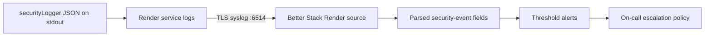

# Production Monitoring and Go-Live Checklist

Last reviewed: 2026-08-01

## Monitoring provider decision

The repository does not currently configure Better Stack, Datadog, or Grafana Cloud. This runbook therefore uses **Better Stack**, the default requested for the project. The backend already writes one-line JSON security events to stdout through `Backend/utils/securityLogger.js`; Render can forward those lines without adding a logging SDK or exposing a provider token to application code.



Render log streaming is configured at workspace/service level in the Render dashboard, not in `render.yaml`. Do not add the Better Stack source token to this repository or to a `VITE_` variable.

## Connect Render to Better Stack

1. In Better Stack, open **Telemetry → Sources → Connect source**.
2. Choose **Logs → Render**, name the source `fitscore-render-production`, and create it.
3. Copy the source's **Ingesting host** and **Source token**. Treat the token as a production secret.
4. In Render, open the workspace and select **Integrations/Observability → Log Streams → Set default**.
5. Enter the Better Stack ingesting host as `HOST:6514` and paste the source token into Render's **Token** field.
6. Leave preview-instance logs disabled unless preview traffic should consume the production log quota. A separate Better Stack source is preferable for previews.
7. Save the stream. Render should begin forwarding backend stdout/stderr over TLS within a few minutes.
8. In Better Stack **Live tail**, filter for `type = security` and confirm that a controlled staging login failure produces a parsed event with these safe fields:

   - `timestamp`, `level`, `type`, `event`
   - `requestId`, `method`, `path`
   - `ipHash`, `userIdHash`
   - limited event metadata such as `reason`, `limiter`, or `retryAfter`

If Render wraps the JSON line in a `message` field, configure Better Stack parsing so the JSON inside `message` is expanded before creating metrics. Do not create extraction rules for request bodies or headers.

References:

- [Render log streams](https://render.com/docs/log-streams)
- [Better Stack Render integration](https://betterstack.com/docs/logs/render/)
- [Better Stack alert configuration](https://betterstack.com/docs/logs/dashboards/alerts/)

## Mandatory data-handling rule

Never ingest into an alert payload, alert title, notification, dashboard label, or escalation message:

- raw request bodies;
- cookies;
- authorization headers;
- email addresses;
- purchase tokens;
- password-reset or reset tokens.

Do not paste these values into incident comments either. Alert messages may contain the event name, service, environment, count, time window, route, limiter name, request ID, and the existing hashed identifiers. `ipHash` and `userIdHash` are pseudonymous identifiers, not anonymous data; restrict access and retention accordingly.

## Better Stack field extraction

In the source's **Configure → Extract metrics** page, expose the following parsed JSON fields as string labels with no aggregation:

| Label | Purpose |
|---|---|
| `type` | Restricts application alerts to `security` records. |
| `event` | Selects the security event. |
| `ipHash` | Groups suspicious activity without sending a raw address. |
| `userIdHash` | Optional account-level grouping. |
| `path` | Identifies the affected route. |
| `limiter` | Distinguishes global, login, signup, reset, and analysis limits. |
| `status_code` | Used only for Render HTTP request logs. |
| `service` | Separates the backend from other Render resources if the source is shared. |

Use `sum(logs_count)`, rather than `count(*)`, for dashboard log-event counts. A reusable chart query is:

```sql
SELECT
  {{time}} AS time,
  sum(logs_count) AS value,
  coalesce(nullIf(label('ipHash'), ''), 'unknown') AS series
FROM {{source}}
WHERE time BETWEEN {{start_time}} AND {{end_time}}
  AND label('type') = 'security'
  AND label('event') = 'login_failed'
GROUP BY time, series
```

Create one chart per rule below. Configure threshold alerts with the stated query period and a 60-second check period. Set a 10-minute recovery period to avoid rapid close/reopen cycles.

## Alert rules

| Alert | Filter and grouping | Trigger | Severity | Initial response |
|---|---|---:|---|---|
| Login failures by source | `type=security`, `event=login_failed`, group by `ipHash` | **>20 in 5 minutes** for one hash | High | Check credential-stuffing pattern; preserve request IDs; consider temporary upstream blocking. |
| Login failure global surge | `type=security`, `event=login_failed`, all series | **>100 in 5 minutes** | High | Compare hashes, deployment timing, and auth-provider health. |
| Account lock spike | `event IN (account_locked, login_locked)`, group by `ipHash` | **≥3 in 15 minutes** for one hash | High | Check whether the same source is locking multiple accounts. |
| Invalid authentication tokens | `event=authentication_invalid`, group by `ipHash` | **>10 in 5 minutes** for one hash, or **>50 globally** | High | Look for replayed/forged/expired-token bursts and recent signing/config changes. |
| CSRF rejection spike | `event=csrf_rejected`, group by `ipHash` and `path` | **>10 in 5 minutes** for one hash and route | High | Check origin/referrer patterns and whether a frontend deployment lost CSRF handling. |
| Repeated rate-limit hits | `event=rate_limit_exceeded`, group by `ipHash` and `limiter` | **≥5 in 5 minutes** for one hash, or **>50 globally** | Medium; High for login/reset/analyze | Identify abusive routes; confirm the limiter is not rejecting normal traffic after a deploy. |
| Webhook authorization failures | webhook path plus `status_code IN (401,403)`, group by path | **≥3 in 5 minutes** | Critical | Validate provider credentials/signatures and check for probing. Never attach the received webhook body. |
| Webhook server failures | webhook path plus `status_code BETWEEN 500 AND 599`, group by path | **≥3 in 5 minutes** | Critical | Check provider delivery retries, database health, and request IDs; preserve idempotency records. |

### Event-name drift

The current authentication route emits `login_locked`; it does not emit `account_locked`. The account-lock chart must match both names so it works now and remains compatible if the canonical name is introduced later. This document does not rename the application event because application changes are outside this task.

### Example account-lock query

```sql
SELECT
  {{time}} AS time,
  sum(logs_count) AS value,
  coalesce(nullIf(label('ipHash'), ''), 'unknown') AS series
FROM {{source}}
WHERE time BETWEEN {{start_time}} AND {{end_time}}
  AND label('type') = 'security'
  AND label('event') IN ('account_locked', 'login_locked')
GROUP BY time, series
```

### Example rate-limit query

```sql
SELECT
  {{time}} AS time,
  sum(logs_count) AS value,
  concat(
    coalesce(nullIf(label('ipHash'), ''), 'unknown'),
    ':',
    coalesce(nullIf(label('limiter'), ''), 'unknown')
  ) AS series
FROM {{source}}
WHERE time BETWEEN {{start_time}} AND {{end_time}}
  AND label('type') = 'security'
  AND label('event') = 'rate_limit_exceeded'
GROUP BY time, series
```

### Webhook status alerts and current blocker

Monitor these exact paths:

- `/billing/webhook`
- `/api/subscriptions/revenuecat/webhook`

Render's native HTTP request logs include request method, path, and status code only on eligible paid workspaces. The committed Blueprint specifies `plan: free` and does not establish that the workspace is Pro or higher. Consequently, webhook 401/403/5xx alerts cannot be considered operational until HTTP request-log availability is confirmed. Do one of the following before go-live:

1. upgrade to a Render workspace/service configuration that provides HTTP request logs, then extract `path` and `status_code` in Better Stack; or
2. in a later application-code task, emit sanitized structured webhook outcome events through `securityLogger`.

Do not infer a 2xx webhook response from the absence of an error log.

Example query once HTTP request fields are available:

```sql
SELECT
  {{time}} AS time,
  sum(logs_count) AS value,
  label('path') AS series
FROM {{source}}
WHERE time BETWEEN {{start_time}} AND {{end_time}}
  AND label('path') IN (
    '/billing/webhook',
    '/api/subscriptions/revenuecat/webhook'
  )
  AND toUInt16OrNull(label('status_code')) IN (401, 403)
GROUP BY time, series
```

For the 5xx rule, replace the final predicate with:

```sql
AND toUInt16OrNull(label('status_code')) BETWEEN 500 AND 599
```

## Notification and ownership configuration

- Route Critical alerts to the primary on-call policy immediately through push/SMS/phone and the incident channel.
- Route High alerts to the security/backend channel immediately; escalate if unacknowledged for 10 minutes.
- Route Medium alerts to the backend channel and ticket queue; escalate only if sustained for 15 minutes.
- Include a dashboard link and runbook link in every notification, but never include a raw log line unless its fields have been reviewed for sensitive data.
- Test every rule from staging and test one end-to-end notification before production launch.

## Required production environment cross-check

Every variable explicitly named in the **Required production environment** section of `SECURITY_HARDENING.md` exists in `Backend/.env.example`. No named variable is missing. Blank values and placeholders still require production configuration.

| Variable | In `.env.example` | Documentation status | Go-live action |
|---|---|---|---|
| `NODE_ENV` | Yes, Runtime | Documented | Set exactly `production`. |
| `FRONTEND_URL` | Yes, Runtime | Documented | Set to the exact deployed frontend origin; no trailing wildcard. |
| `JWT_SECRET` | Yes, Authentication | Documented | Generate at least 32 cryptographically random bytes. Never reuse a development value. |
| `DB_HOST` | Yes, PostgreSQL | Documented | Set from the Supabase direct/session-pooler connection details as appropriate. |
| `DB_PORT` | Yes, PostgreSQL | Documented | Match the selected Supabase endpoint. |
| `DB_NAME` | Yes, PostgreSQL | Documented | Set the production database name. |
| `DB_USER` | Yes, PostgreSQL | Documented | Use the production database user. |
| `DB_PASSWORD` | Yes, PostgreSQL | Documented | Store only in Render's secret environment settings. |
| `DB_SSL` | Yes, PostgreSQL | Documented | Keep TLS enabled in production. |
| `REVENUECAT_SECRET_KEY` | Yes, Payments and RevenueCat | Documented | Use a server-side secret API key. |
| `REVENUECAT_WEBHOOK_AUTH` | Yes, Payments and RevenueCat | Documented | Set the entire expected Authorization value, including its scheme. |
| `REVENUECAT_WEBHOOK_SIGNING_SECRET` | Yes, Payments and RevenueCat | Documented | Set the same HMAC secret configured at RevenueCat. |
| `REVENUECAT_APP_IDS` | Yes, Payments and RevenueCat | Documented | Set the comma-separated production app allowlist. |
| `REVENUECAT_ENTITLEMENT_ID` | Yes, Payments and RevenueCat | Documented | Must exactly match the RevenueCat entitlement identifier. |
| `GOOGLE_SERVICE_ACCOUNT_JSON` | Yes, Google | Documented | Store one-line JSON in Render; grant only required Google permissions. |
| `GOOGLE_PACKAGE_NAME` | Yes, Google | Documented | Must match the signed Android application ID. |
| `GOOGLE_RTDN_AUDIENCE` | Yes, Google | Documented | Set the exact public `/billing/webhook` URL used as the Pub/Sub OIDC audience. |
| `GOOGLE_RTDN_SERVICE_ACCOUNT` | Yes, Google | Documented | Set the exact Pub/Sub push-authentication service-account email. |
| `GOOGLE_SUBSCRIPTION_IDS` | Yes, Google | Documented | Set the comma-separated Google Play product allowlist. |

### Additional production variables not enumerated in that section

The security document says `.env.example` is the complete checklist, but its short required-environment block does not enumerate every feature-dependent production variable. Confirm these separately:

- Database verification: `DB_SSL_REJECT_UNAUTHORIZED`; optionally `DB_SSL_CA` when the provider uses a private CA.
- Token policy: `JWT_ACCESS_TTL`, `REFRESH_TOKEN_TTL_DAYS`, `JWT_ISSUER`, `JWT_AUDIENCE`, `BCRYPT_COST`.
- Abuse limits: all `*_RATE_LIMIT` variables.
- Play Integrity: `PLAY_INTEGRITY_ENFORCEMENT_ENABLED`, `PLAY_INTEGRITY_MAX_TOKEN_AGE_MS`, and optionally `PLAY_INTEGRITY_ALLOWED_CERT_DIGESTS`. Keep enforcement off until a Play-installed release passes end-to-end verification.
- Razorpay: `RAZORPAY_KEY_ID`, `RAZORPAY_KEY_SECRET` when Razorpay is enabled.
- AI/media/email: Gemini, Cloudinary, and Brevo variables when those features are enabled.
- Runtime URLs: `FRONTEND_URLS` and `APP_URL` where the deployment uses them.

The updated `render.yaml` now declares the required database TLS, RevenueCat webhook, Google RTDN, and Play Integrity variables without committing their values. Variables marked `sync: false` must still be populated in the Render dashboard.

## Android release CI blocker

`ANDROID_HOME` was not available to the last release-build environment. A later local debug build could access an installed SDK and compile successfully, but that does not prove a reproducible signed release APK/AAB pipeline. Treat the missing release-runner Android SDK configuration as a **go-live blocker** for a real CI Android release build.

Recommended closure:

1. Use a GitHub Actions Ubuntu runner with Java 17 and `android-actions/setup-android` (or an equivalent maintained Android image).
2. Install the exact Android SDK platform/build-tools required by `mobile/config.xml` and run `cordova requirements android`.
3. Restore the signing keystore and passwords from GitHub Actions encrypted secrets; never commit them or echo them.
4. Run frontend tests/build, `npm run test:integrity`, Cordova prepare, and the signed AAB release build.
5. Upload the AAB as an artifact, install it through Google Play internal testing, and exercise Play Integrity plus RevenueCat/Razorpay verification before enabling production enforcement.

## Final go-live checks

- [ ] Better Stack Render source receives parsed production JSON events.
- [ ] Source token exists only in Better Stack and Render configuration.
- [ ] All six security-event alert families are created and test notifications reach on-call.
- [ ] `login_locked` is included in the account-lock alert until event naming is standardized.
- [ ] Webhook status logging is available; the current free-plan limitation is resolved.
- [ ] Alert payloads contain none of the prohibited secrets or personal fields.
- [ ] Every required environment value above is populated and independently reviewed.
- [ ] Play Integrity remains disabled until the Play-installed build passes verification.
- [ ] A reproducible signed Android CI release succeeds with a valid Android SDK and `ANDROID_HOME`/SDK path.
- [ ] One rollback drill and one alert-recovery drill have been completed before launch.
