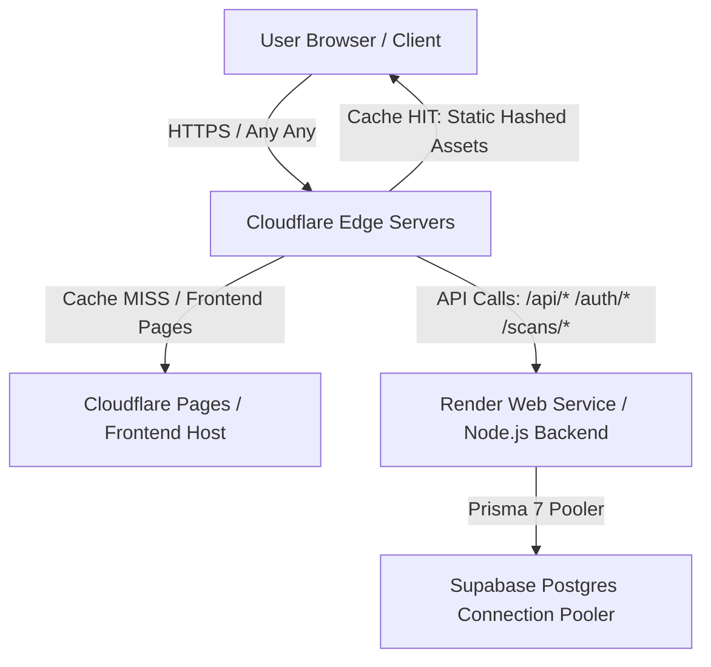

# bitezsnap — Production Cloudflare CDN & Edge Integration Blueprint

This document outlines the step-by-step production blueprint to route and configure **bitezsnap** behind Cloudflare CDN. By routing client and server traffic through Cloudflare’s edge nodes, you gain globally distributed caching, sub-10ms response times for static resources, advanced DDoS defense, and intelligent backend routing.

---

## 🗺️ High-Level Topology



---

## 1. Cloudflare Pages Frontend Configuration

Cloudflare Pages automatically processes the [_headers](file:///d:/bitezsnap/public/_headers) file we created in the `public/` folder during deployment. It propagates these exact cache instructions to all Cloudflare edge nodes globally:
- **Vite Hashed Assets (`/assets/*`):** Caching duration set to `max-age=31536000, immutable`. Since compiled asset URLs contain cryptographically unique hashes, they are safely cached forever at the edge and browser.
- **Images and SVGs:** Cache duration set to `max-age=2592000` (30 days) with `must-revalidate` to pull new versions immediately if updated.
- **Landing Page (`/` and `index.html`):** Cache duration set to `max-age=0, must-revalidate`. This ensures the entry page is checked on every visit, immediately hot-swapping older compiled bundle links with fresh updates when a new build is deployed!

---

## 2. Express Backend CDN Caching Rules

Dynamic API routes (like `/api/analyze`, `/auth`, and `/scans`) must **never** be cached by CDN edge nodes, as they process user-specific and live database transactions. 

### Recommended Backend Cache-Control Middlewares

If you introduce static file endpoints in the Express server in the future (e.g. user avatar uploads, custom icons), mount the route using highly optimized, CDN-compliant `Cache-Control` headers:

```javascript
const express = require('express');
const path = require('path');
const app = express();

// Mount public static files with explicit CDN Cache-Control headers
app.use('/public', express.static(path.join(__dirname, 'public'), {
  maxAge: '1y',
  immutable: true,
  setHeaders: (res, path) => {
    // Force Cloudflare and browsers to cache forever (1 year)
    res.setHeader('Cache-Control', 'public, max-age=31536000, immutable');
    // Enable cross-origin resource sharing (CORS) for frontend domain
    res.setHeader('Access-Control-Allow-Origin', '*');
  }
}));
```

---

## 3. Cloudflare Portal Configuration (DNS & Page Rules)

To route the bitezsnap system securely and optimize connection speed, configure these parameters inside your [Cloudflare Dashboard](https://dash.cloudflare.com):

### A. DNS Proxying (Orange-Cloud)
- Create an `A` or `CNAME` record for your backend custom domain (e.g. `api.fitscan.com` pointing to Render's URL).
- Set the toggle under **Proxy Status** to **Proxied** (the Orange Cloud icon).
- This masks your Render origin IP and applies Cloudflare's edge proxy layer.

### B. Enforce Strict SSL Encryption
- Navigate to **SSL/TLS** -> **Overview** inside Cloudflare.
- Set encryption mode to **Full (Strict)**.
- *Why:* This ensures the data traffic between the user and Cloudflare is encrypted, and the connection between Cloudflare and your Render backend is also fully encrypted using authentic, validated SSL/TLS certificates.

### C. Backend API Caching Bypass (Cache Rules)
To make absolutely sure that Cloudflare edge nodes never accidentally cache sensitive dynamic API endpoints:
1. Navigate to **Caching** -> **Cache Rules** -> **Create Rule**.
2. Name the rule: `Bypass Caching for Dynamic API`.
3. In **Field**, select `URI Path`.
4. In **Operator**, select `starts with`.
5. In **Value**, enter `/api/` (add additional fields for `/auth/` and `/scans/` using `Or` operators).
6. Under **Cache Eligibility**, select **Bypass Cache**.
7. Click **Deploy**.

---

## 4. Latency & Performance Optimization Tweaks

Enable these optimizations under the **Speed** and **Caching** menus in Cloudflare to minimize network hops and payload sizes:

- **Tiered Caching (Cache Reserve):** Enable under **Caching** -> **Configuration**. This routes cache misses through a topology of regional Cloudflare hub servers instead of slamming your single Render origin server.
- **Argo Smart Routing:** Enable under **Speed** -> **Optimization**. Argo dynamically routes traffic across the fastest network paths on Cloudflare’s global backbone, reducing network latency by an average of 30%.
- **Brotli Compression:** Enable under **Speed** -> **Optimization** to gain high-speed content compression (compressing files far more efficiently than standard Gzip).
